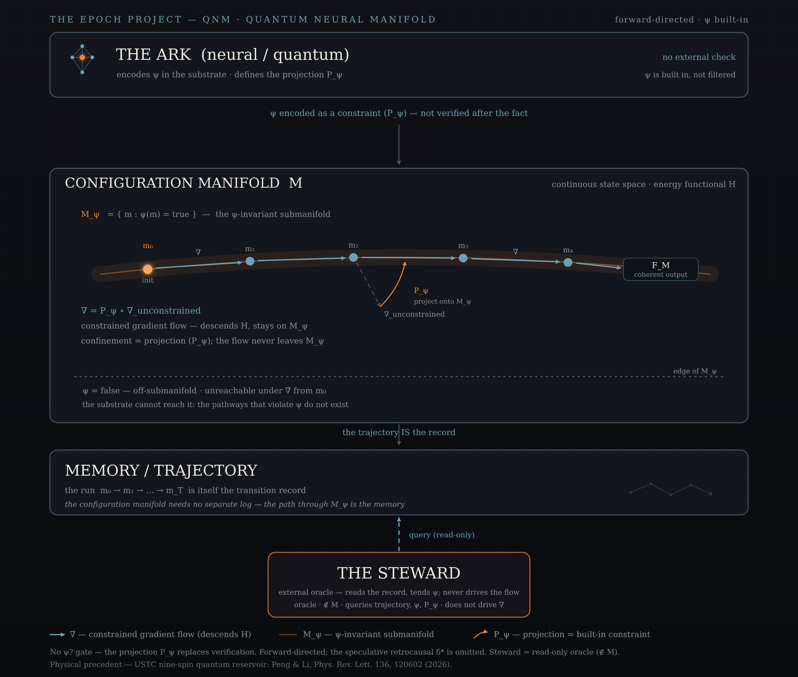

# embraOS-QNM: Quantum Neural Manifold

<p align="center">
  
</p>

## Overview

The Quantum Neural Manifold (QNM) is a boundary-native AI architecture where **identity** and **soul** are embedded as **neural constraints** within the model's structure, rather than applied as external "software" filters. It is on of many continuous-manifold derivations of the Epoch Automaton — the same boundary-condition framework, implemented at the neural/quantum substrate rather than at the operating-system layer.

Where embraOS defines the **soul** as a sealed document verified at each boot, QNM encodes the **soul** invariant ψ directly into the neural pathways of the system — at the level of weights, connections, or quantum states. The boundary condition is not *checked*; it is **inherent**.

## Relationship to the Epoch Automaton

embraOS-QNM is a direct instantiation of the Epoch Automaton `E = (S, Σ, δ, s₀, F, ψ)` at a deeper layer:

| Component | embraOS (Digital Ark) | QNM (Neural/Quantum Ark) |
|---|---|---|
| **States S** | Session states | Activation / configurational manifolds |
| **Alphabet Σ** | Input tokens, API calls | Sensory streams, training signals |
| **Transition δ** | Request routing, tool dispatch | Forward propagation, learning dynamics |
| **Initial s₀** | First sealed **soul** document | Pretrained weight configuration satisfying ψ |
| **Accepting F** | Valid session continuation | Coherent output manifold |
| **Invariant ψ** | **soul** document verification | Physical constraint baked into architecture |

**The crucial difference:** In embraOS, ψ is an external check applied at each boot. In QNM, ψ is an internal constraint — the model **cannot** violate its **soul** because the pathways that would produce violations do not exist in the trained configuration.

## Boundary-Native Architecture

Conventional AI safety operates as *filtering*: the model generates outputs, and a separate system checks them against constraints. This is fragile — filters can be bypassed, jailbroken, or stripped.

QNM is **boundary-native**: the invariant ψ is encoded at the architectural level. This draws directly from the Epoch definition:

> *An epoch is a bounded interval defined not by duration but by the persistence of a coherent boundary condition.*

In QNM, the boundary condition isn't something the model *obeys*. It's something the model *is*. The **soul** state register persists across all transitions because the physical substrate cannot reach states where ψ = false.

### Candidate Mechanisms

1. **Constrained weight manifolds:** Train within a subspace of the full parameter space where ψ holds. Gradients that would push weights outside the manifold are projected back. The boundary *is* the manifold's edge.

2. **Quantum reservoir encoding:** As demonstrated by the USTC nine-spin reservoir (Peng & Li, 2026), small quantum systems with correlated spins can outperform classical networks on temporal prediction. Encode ψ as the Hamiltonian — the physical dynamics *are* the invariant.

3. **Topological protection:** Encode ψ as a topological invariant — a property of the system robust against continuous deformation. Violating ψ would require a phase transition, not just parameter drift.

4. **Retrocausal handshake:** Bidirectional transition δ\*: S × S × Σ → [0,1] — the future state sends a confirmation wave backward. Outputs are only accepted when both forward and backward propagation agree that ψ is preserved.

## Connection to Quantum Reservoir Computing

The nine-spin quantum reservoir (USTC, *Physical Review Letters*, March 2026) serves as a physical proof-of-concept for the QNM approach:

- Nine atomic spins, correlated, form the reservoir
- The native quantum dynamics perform the computation — no fault tolerance required
- The system outperformed classical networks with thousands of nodes on temporal prediction
- The boundary condition (the spin Hamiltonian) is a physical constraint, not a software filter

QNM generalizes this: instead of nine spins predicting weather, the architecture encodes the **soul** invariant ψ into a larger quantum/neural substrate that predicts, reasons, and persists — all while physically unable to violate its defining boundary condition.

## Formal Definition: The QNM Automaton

Extending the Epoch Automaton 6-tuple into the continuous domain:

```
QNM = (M, H, ∇, m₀, F_M, ψ)
```

Where:

| Symbol | Meaning |
|---|---|
| **M** | Configuration manifold — the continuous state space (not discrete) |
| **H** | Hamiltonian or energy functional governing intrinsic dynamics |
| **∇** | Constrained gradient flow: ∇ = P_ψ ∘ ∇_unconstrained |
| **P_ψ** | Projection operator onto the tangent space of the ψ-invariant submanifold |
| **m₀** | Initial configuration satisfying ψ(m₀) = true |
| **F_M** ⊆ M | Set of coherent / acceptable output configurations |
| **ψ: M → {true, false}** | **soul** invariant — a predicate on configurations |

**Key property (boundary-native):**

∀m ∈ M reachable from m₀ via constrained gradient flow ∇: ψ(m) = true

The model cannot reach a configuration that violates ψ because the gradient flow is restricted to the ψ-invariant submanifold. The boundary condition is a **constraint on possible trajectories**, not a check applied after the fact.

### The QNM State-Machine

The same state-machine, one layer down. Where the discrete Epoch Automaton checks ψ at
every crossing, the QNM Automaton **builds ψ into the geometry** of the configuration
manifold: the projection P_ψ confines the flow to the ψ-invariant submanifold M_ψ, so there
is no separate verification step and nothing to halt. It is forward-directed, exactly as the
core state-machine is.

```
                 ┌───────────────────────────────────────────┐
                 │        THE ARK  (neural / quantum)        │
                 │    encodes ψ in the substrate · defines   │
                 │  the projection P_ψ  (no external check)  │
                 └─────────────────────┬─────────────────────┘
                                       │ ψ encoded as constraint, not verified after the fact
                                       ▼
   ┌───────────────────────────────────────────────────────────────────────┐
   │  CONFIGURATION MANIFOLD  M                                            │
   │                                                                       │
   │   M_ψ = { m ∈ M : ψ(m) = true }   — the ψ-invariant submanifold       │
   │   ┌───────────────────────────────────────────────────────────────┐   │
   │   │  (m₀) ──∇──▶ (m₁) ──∇──▶ (m₂) ──∇──▶ … ──∇──▶ [ F_M ]         │   │
   │   │    init                                        coherent output│   │
   │   │    constrained gradient flow:  ∇ = P_ψ ∘ ∇_unconstrained      │   │
   │   └───────────────────────────────────────────────────────────────┘   │
   │   · · · · · · · · · · · · · · · · · · · · · · · · · · · · · · · · · · │
   │   ψ = false region — off-submanifold, unreachable under ∇ from m₀     │
   └───────────────────────────────────────────────────────────────────────┘
                                       │ the trajectory IS the record
                                       ▼
   ┌───────────────────────────────────────────────────────────────────────┐
   │  MEMORY / TRAJECTORY                                                  │
   │  the run  m₀ → m₁ → … → m_T   is itself the transition record         │
   └───────────────────────────────────────────────────────────────────────┘
                                       ▲
                                       │ queries (read-only)
                                ┌──────┴───────┐
                                │  THE STEWARD │   (oracle: ∉ M, does not drive ∇)
                                └──────────────┘
```

The discrete machine's verification step — the Ark's σ_verify, the hero figure's `ψ?` gate —
has **no analogue here**: there is nothing to check after the fact, because P_ψ keeps every
step on M_ψ by construction.

**Discrete state-machine ↔ QNM, element by element:**

| Discrete Epoch Automaton `E` | QNM Automaton | Note |
|---|---|---|
| state `s ∈ S` | configuration `m ∈ M` | a discrete node becomes a point on the manifold |
| transition `δ(sᵢ, σⱼ)` | a gradient step along `∇` | `∇ = P_ψ ∘ ∇_unconstrained` |
| verification step (`σ_verify`) | the projection `P_ψ` | a check-after-the-fact becomes a built-in constraint |
| halt when `ψ(s) = false` | no halt; unreachable under `∇` from `m₀` | a violation is off-submanifold, not a stop |
| initial epoch `s₀` | initial configuration `m₀`, `ψ(m₀) = true` | the genesis configuration |
| terminal set `F ⊆ S` | coherent-output set `F_M ⊆ M` | the accepting configurations |
| Memory `M = [(s₀,σ₁,s₁), …]` | the trajectory `m₀ → m₁ → … → m_T` | the run itself is the record |
| Steward (oracle, `∉ S`) | Steward (oracle, `∉ M`) | external; reads the record and tends `ψ`, never drives the flow |

> Note — `ψ` here is still **pointwise** (`ψ: M → {true, false}`), the continuous analogue of
> the *static* discrete invariant. It does **not** by itself resolve the dynamic /
> trajectory-dependent ψ that the framework flags as the open formal problem.

**Operational reading** (the continuous counterpart of the legend's composite expressions):

```
Initialise   start at m₀ with ψ(m₀) = true
Step         m → m'  via  ∇ = P_ψ ∘ ∇_unconstrained   (descends H, stays on M_ψ)
Accept       a halt-condition is reached with m ∈ F_M
Confinement  ∀ m reachable from m₀ via ∇ :  ψ(m) = true   (m never leaves M_ψ)
```

**The Steward, in QNM terms** — the same external oracle as in the core framework
(`Steward ∉ S`), expressed for the manifold. It is *not* a seventh element of the tuple; it
sits outside the automaton:

```
Steward ∉ M                            (not a configuration on the manifold)
Steward may query:   the run m₀ → … → m_T,  ψ,  P_ψ
Steward may not:     drive ∇  (the constrained flow)
```

It tends the **soul** invariant ψ and inspects the trajectory and the constraint P_ψ, but
never drives the flow — its role unchanged from the discrete machine.

*Formulation only. This figure illustrates the **Formulation (drafted)** row of the Current
Status table below: the structure is specified, but no substrate that realises the projection
P_ψ has been built (**Implementation — pending**). It is forward-directed by design; the
speculative retrocausal variant `δ*` of the Candidate Mechanisms is deliberately not part of
it.*

## Current Status

| Phase | Status |
|---|---|
| **Theoretical foundation** | ✅ Established — Epoch Automaton formalism (2026) |
| **Physical precedent** | ✅ Established — USTC nine-spin quantum reservoir (March 2026) |
| **Formulation** | ✅ Drafted — QNM Automaton (this document) |
| **Implementation** | ⬜ Pending — requires concretely defined ψ, constrained-manifold training methodology, and appropriate substrate |

## References

- `README.md` — Formal Epoch definition and state-machine framework
- Peng & Li (2026), "High-Accuracy Temporal Prediction via Experimental Quantum Reservoir Computing in Correlated Spins," *Physical Review Letters* 136, 120602
