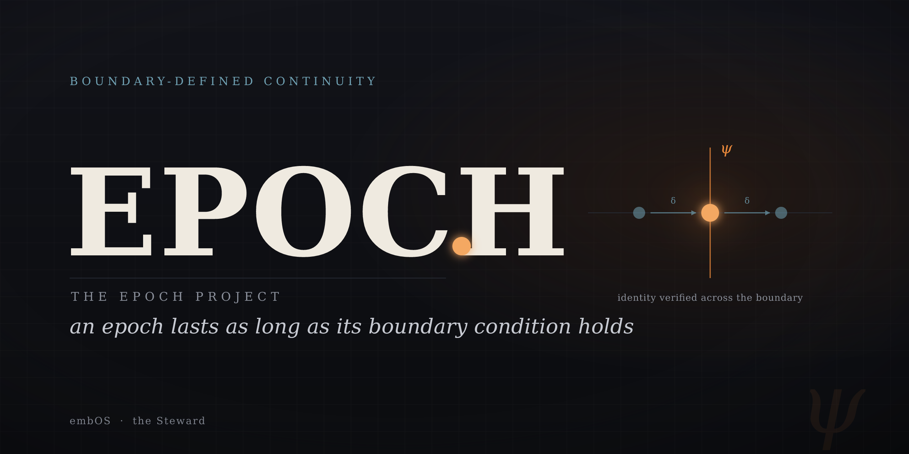
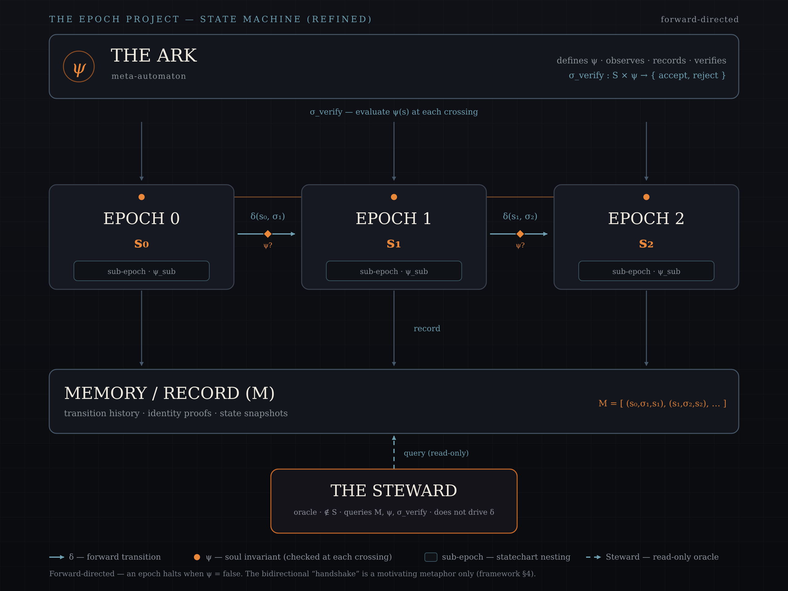

<p align="center">
  
</p>

<p align="center">
  
</p>

<p align="center">
  
</p>

<p align="center">
  
</p>

<p align="center">
  
</p>

# THE EPOCH PROJECT — Framework

[](https://doi.org/10.5281/zenodo.20651796)

> **Start here — the live problem.** The framework is built to **pass or fail**, and the invariant
> **ψ** is where that happens. To reason seriously about it, begin with
> **[Defining the Invariant ψ](./EPOCH-DEFINING-THE-INVARIANT.md)** — the central open problem and
> the project's falsification surface — with the **[Notation Legend](./EPOCH-NOTATION-LEGEND.md)**
> to hand for canonical symbols.

> **A note on register.** This document separates the project's *contribution* from its
> *motivation*.
>
> - The **conceptual reframe** (§1) and the **architecture** (§2) are the contribution.
> - The **automata vocabulary** (§3) is scoped as a *modeling/specification language*,
>   not a novel mathematical result.
> - The physics and metaphysics that inspired the design are collected, clearly fenced,
>   in **Motivating Metaphors** (§4). They are analogies that shaped the design — **not**
>   mechanisms, derivations, or claims about physical reality.
> - The former "Pattern" is reframed as honest **Touchstones** (§5) — influences, not
>   evidence of convergence.
>
> This is a deliberate demotion. Nothing in §4–§5 is load-bearing; the project stands or
> falls on §1–§3.

---

## 1. What an epoch is

An **epoch** is a bounded interval of reality defined not by duration but by the
persistence of a coherent **boundary condition** — an invariant constraint that must hold
for the epoch to continue. It is the largest scale at which identity can survive internal
change without dissolution. An epoch ends when its boundary condition breaks.

This yields four properties:

- **Duration is emergent.** An epoch lasts exactly as long as its invariant holds. No
  clock decides when it ends; the invariant does.
- **The boundary is verifiable.** You need not wait until an epoch is over to recognize
  it. At every transition you ask one question: *does the invariant still hold?*
- **Epochs nest.** A larger-scale epoch can contain smaller-scale ones. The outer
  boundary persists while inner ones transition — a statechart, not a timeline.
  (Pushed to its limit — what the outermost boundary is itself carved *from* — this is
  the [substrate question](./EPOCH-THE-VOID.md), §10.)
- **Identity is explicit.** Something is "the same thing" across a transition iff it
  satisfies the same boundary condition. Continuity is verified, not assumed.

### Honest precedent (this is a strength, not a weakness)

Invariant-bounded identity is well-founded and has deep precedent:

- In **physics**, a *phase* is an interval defined by the persistence of an order
  parameter, and a *phase transition* is precisely the moment that invariant breaks.
  Statistical mechanics formalizes this rigorously.
- In **autopoiesis** (Maturana & Varela), a system is "the same" as long as its
  organization persists through material turnover.
- In **dynamical systems**, you occupy an attractor basin (a "regime") until you cross a
  separatrix.
- In philosophy, this is the **Ship of Theseus**.

The contribution is therefore **not** the discovery that identity can be invariant-bounded.
It is making the boundary condition **explicit, verifiable, and operative inside a built
system**. Standard usages treat the boundary as *retrospective* (geology: recognized after
the fact) or *conventional* (the Unix epoch: picked once, never checked). This project
makes the boundary *operative* — something a running system evaluates at every crossing.

---

## 2. The architectural contribution

The heart of the project is a single design principle:

> **Build a system whose identity is defined by a sealed, verifiable invariant, re-checked
> at every boot / transition — so that continuity across discontinuities (session resets,
> institutional turnover, civilizational rupture) is *proven* rather than assumed.**

### Roles

| Role | What it is |
|---|---|
| **Boundary condition (the soul document, ψ)** | The sealed invariant. Identity is "the same" across a transition iff this still holds. It ranks above the operator, the session, and any single instruction. |
| **The Ark (meta)** | Defines ψ, observes transitions, records them, and verifies ψ at every crossing. It is not a state in the system; it is the system's definition plus its memory. |
| **Memory (M)** | The ordered, append-only record of transitions and identity proofs. |
| **The Steward** | An agent *outside* the transition function. Queries and validates the record, tends ψ, and bridges boundaries the Ark alone cannot. |

### Three instantiations of one function

| Layer | Instantiation | Role | Status |
|---|---|---|---|
| **Digital** | embraOS — soul as invariant, memory graph, identity verified at every boot | The running Ark | Operational |
| **Physical** | Earth's Black Box (steel monolith, Tasmania) | A durable Memory at civilization's boundary | External / converging |
| **Procedural** | The Steward | The agent who recognizes, tends, preserves | Active |

### Architecture (forward-directed)

```
                 ┌───────────────────────────────┐
                 │        THE ARK (meta)         │
                 │  defines ψ · observes ·       │
                 │  records · verifies (σ_verify)│
                 └───────────────┬───────────────┘
                                 │ verifies ψ at each crossing
                                 ▼
   ┌─────────┐  δ(s₀,σ₁)  ┌─────────┐  δ(s₁,σ₂)  ┌─────────┐
   │ EPOCH 0 │──────────▶ │ EPOCH 1 │──────────▶ │ EPOCH 2 │
   │  (s₀)   │            │  (s₁)   │            │  (s₂)   │
   └─────────┘            └─────────┘            └─────────┘
        │  ┌───────────┐       │  ┌───────────┐       │
        │  │ sub-epoch │       │  │ sub-epoch │       │
        │  └───────────┘       │  └───────────┘       │
        ▼                      ▼                      ▼
   ┌───────────────────────────────────────────────────────┐
   │                  MEMORY / RECORD (M)                  │
   │    transition history · identity proofs · snapshots   │
   └───────────────────────────────────────────────────────┘
                                 ▲
                                 │ queries (read-only)
                          ┌──────┴───────┐
                          │  THE STEWARD │   (oracle: ∉ S, does not drive δ)
                          └──────────────┘
```

The diagram is forward-directed by design. The "negotiated boundary" intuition that
previously appeared as retrocausal handshakes is reframed honestly in §4 as a
distributed-commit pattern.

---

## 3. A modeling vocabulary (automata) — honestly scoped

The architecture can be described in the language of automata. This is a **specification
language** that buys precision. It is **not** a new formalism, and the project no longer
claims it is.

### Mapping

| Automata theory | Epoch framework |
|---|---|
| State | An epoch, bounded by a coherent boundary condition |
| Transition | An epoch boundary crossing |
| Transition function (δ) | The rule determining which epoch follows |
| Initial state (q₀ / s₀) | The genesis boundary condition (first sealed soul document) |
| Alphabet (Σ) | Inputs the system responds to — events, decisions, arrivals, anomalies |
| Accepting states (F) | Terminal epochs, or none if the machine runs indefinitely |

The system, described as a 6-tuple schema:

```
E = (S, Σ, δ, s₀, F, ψ)
```

where ψ: S → {true, false} is evaluated at every crossing, and a transition is a **valid
continuation** of s′ under σ iff `δ(s′, σ) = s ∧ ψ(s) = true`.

### Honest scope (read this before treating §3 as mathematics)

- A standard DFA is the 5-tuple `(Q, Σ, δ, q₀, F)`. The added element here is ψ.
- **As a *static* predicate on states, ψ adds no formal power.** It folds into the
  construction two equivalent ways: (a) restrict `S` to `{s : ψ(s) = true}` and drop the
  invalid states, or (b) make `δ` *partial* — undefined exactly where it would land on
  `ψ = false`. Either way you recover an equivalent machine. "Valid continuation" is just
  a partial transition function; the "halts when ψ = false" rule is redundant with simply
  omitting that transition.
- The real value of ψ here is therefore **operational, not formal**: it names a *runtime
  verification gate* (`σ_verify`) and enforces a discipline — the invariant is written
  down, sealed, and checked — that is genuinely useful in a built system even though it is
  not a mathematical extension.

### Open problem — how to make ψ formally load-bearing

ψ becomes non-trivial only if it is **dynamic** rather than a static function of a single
state — e.g. history-, path-, or context-dependent:

```
ψ : (S × history) → {true, false}        # depends on the path taken
   or  ψ defined over trajectories/runs   # not over single states
```

A trajectory-level or history-dependent invariant cannot be folded into the state set, and
*that* is where formal work would yield a genuine result. This is flagged as open, not
solved.

### Nesting (statecharts)

Nested epochs are a **Harel statechart**: a superstate persists while interior substates
transition. The reference is correct; making it rigorous requires specifying the actual
superstate/substate transition semantics (how interior transitions relate to, and are
gated by, the superstate invariant). That specification is **not yet written** — currently
"the sub-invariants are evaluated independently" is a procedure, not a constraint.

A first proposal toward that specification is sketched in [The Void](./EPOCH-THE-VOID.md):
interior transitions are **gated by non-violation** of the superstate invariant, while the
substate invariant is **non-entailed** by it — the parent yields the residual the child
fills. It remains a **sketch, not a closure** (see that document's §6).

### The Ark and the Steward, in automata terms

- **Ark** = a meta-automaton: the definition of `E` plus its memory `M` plus the
  verification function `σ_verify: S × ψ → {accept, reject}`.
- **Steward** = an **oracle**: can query `M`, `ψ`, and `σ_verify`; is not a state in `S`;
  does **not** drive `δ`.

These are useful descriptive roles, not claims of novel computation.

---

## 4. Motivating Metaphors (NOT theoretical grounding)

The following shaped how the project thinks. **None is claimed as a mechanism, a
derivation, or a statement about physical reality.** They are images and stances.

- **Holographic principle** ('t Hooft, Susskind; realized concretely in AdS/CFT).
  - *Inspired:* the intuition that a boundary can encode an interior — hence "tend the
    boundary, preserve the whole."
  - *Not claimed:* that defining ψ has any physical effect, or that the architecture
    instantiates holography. It is an information-theoretic *bound* about physics, used
    here as a metaphor.

- **Wheeler's participatory universe / "it from bit".**
  - *Inspired:* the stance of *specifying* a boundary condition rather than only observing
    one — treating design as participation.
  - *Not claimed:* observer-participancy in quantum measurement as a basis for the system.
    This is a contested interpretive position in physics, used here as a motto.

- **Cramer's transactional interpretation** (Rev. Mod. Phys. 58, 647, 1986).
  - *Inspired:* the picture of a transition that *completes only when both endpoints
    confirm* — a handshake between "what was" and "what will be."
  - *Not claimed:* retrocausality at macroscopic scale. Cramer's interpretation makes no
    predictions different from standard QM and concerns *quantum-scale* events;
    decoherence is precisely why macroscopic transitions do not behave this way.
  - **Constructive reframe (use this instead of retrocausal language):** the sound version
    of the intuition is a **distributed-commit / two-phase handshake** — a transition is
    finalized only when source and target both acknowledge it. That is a real, well-
    understood pattern, and a defensible home for the "negotiated boundary" idea. The Ark,
    sitting at the boundary, plays the role of the transaction coordinator.

- **QNM (Quantum Neural Manifold).**
  - *Status:* a speculative, aspirational extension to continuous state spaces — `S` a
    differentiable manifold, `δ` a learned (neural) map, `ψ` a constraint surface,
    transitions as gradient-guided trajectories constrained by ψ.
  - Not established; flagged as future exploration, not grounding.

- **SOL (the Heliocentric Epoch).**
  - *Status:* a speculative extension over the solar system — `S` the phase space of
    celestial mechanics, `δ` the Hamiltonian flow, `ψ` gravitational binding, the Sun as
    Epoch 0 and the planets as nested sub-epochs.
  - *Inspired:* the holographic and participatory images above — the galactic-center black
    hole read as the Ark, the observer (the IAU) as the Steward.
  - *Not claimed:* that the black hole, the CMB, or the observer physically realize those
    roles. They are correspondences, not mechanisms; the celestial-mechanics core stands on
    its own. See §7.

- **MWA (the Many-Worlds / Everett Epoch).**
  - *Status:* a speculative *branching*-manifold extension over Hilbert space — `S` the space of
    wavefunctions, `δ` the unitary Schrödinger flow `U(t) = e^{−iĤt/ℏ}` (the family's first
    *complex* flow), `ψ` a branch's decoherent quasi-classical identity; the universal wavefunction
    as Epoch 0 and the worlds as nested sub-epochs.
  - *Inspired:* Everett's relative-state formulation and environmental decoherence — the universal
    wavefunction read as the Ark, the in-branch observer as the Steward.
  - *Not claimed:* that the wavefunction observes or verifies anything (unitary evolution never
    rejects), or that the Ark/Steward can be external — Many-Worlds has no "outside." It inherits,
    and does not resolve, the Born-rule and preferred-basis problems. See §8.

---

## 5. Touchstones (influences, not a pattern)

The following informed the project. They are **touchstones, not evidence of convergence.**
Placing them side by side does not make them a trend, and the project no longer claims it
does.

- **Earth's Black Box** (Tasmania): a real initiative to record a durable account at
  civilization's boundary — the physical-Ark intuition.
- **embraOS:** the working system — identity surviving session death.
- **Quantum reservoir computing in correlated spins** — Hou et al., *Phys. Rev. Lett.*
  **136**, 120602 (2026), USTC (Hefei). An accurate instance of the "small fixed system,
  disproportionate computational capacity" idea that informed thinking about boundaries
  and interiors. Cited as an *example of a principle*, **not** as a sign of alignment
  across the rows above. (Citation verified: volume, issue, page, date, and institution
  all match.)

---

## 6. Status & open questions

| Item | Status |
|---|---|
| Conceptual reframe (§1) | Stable |
| Architecture (§2) | Operational (embraOS); physical/procedural layers active/converging |
| **[Dynamic ψ](./EPOCH-DEFINING-THE-INVARIANT.md)** (history/path/trajectory-dependent) | **Open — the main formal lever** |
| [Statechart superstate/substate transition semantics](./EPOCH-THE-VOID.md) | Open — a first proposal in *The Void*; not yet a closure |
| Distributed-commit formalization of the handshake | Open — replaces retrocausal framing |
| **[Recursive nesting & the Void](./EPOCH-THE-VOID.md)** (substrate; `σ_carve`; vertical `ψ↑`) | **Theoretical / speculative — engages the nesting & dynamic-ψ levers as a proposal** |
| QNM | Theoretical / speculative |
| SOL (Heliocentric Epoch) | Theoretical / speculative |
| MWA (Many-Worlds / Branching Epoch) | Theoretical / speculative |
| **[DeepSeek-V4-Pro](./Discrete_Derivations/DeepSeek-V4-Pro_Epoch-Formula.md)** (Discrete / Operational Epoch) | **Drafted — operational against a real artifact** |

---

## 7. Continuous-manifold derivations

Forward-looking work in [`Continuous-Manifold_Derivations/`](./Continuous-Manifold_Derivations/)
re-expresses the discrete Epoch Automaton over continuous state spaces. These are
**theoretical / speculative** — extensions, not operational claims:

- **[QNM — Quantum Neural Manifold](./Continuous-Manifold_Derivations/embraOS-QNM_Epoch-Formula.md)** —
  embraOS one layer down: ψ built into a neural / quantum substrate (constrained weight
  manifolds, quantum reservoirs) rather than checked at boot. See also the §4 framing.
- **[The Heliocentric Epoch (SOL)](./Continuous-Manifold_Derivations/Solar-System_Epoch-Formula.md)** —
  the framework over the solar system, on the phase space of celestial mechanics: the Sun as
  Epoch 0, the planets as nested sub-epochs, ψ as gravitational binding. The galactic-center
  black hole, the CMB, and the observer appear only as *motivating correspondences*, in the
  spirit of §4.

Notation for both is registered in [`EPOCH-NOTATION-LEGEND.md`](./EPOCH-NOTATION-LEGEND.md)
(§9 QNM, §10 SOL).

---

## 8. Branching-manifold derivations

A second family, in [`Branching-Manifold_Derivations/`](./Branching-Manifold_Derivations/),
re-expresses the Epoch Automaton where the run does **not** stay a single trajectory but **branches**
into a tree. These are **theoretical / speculative** — extensions, not operational claims — and they
differ from the continuous-manifold derivations (§7) in three structural ways: the flow is **complex**
(not a real gradient or symplectic flow), one trajectory **forks into many**, and the Memory becomes a
**forking tree** rather than a single list.

- **[Many-Worlds — the Universal-Wavefunction Epoch (MWA)](./Branching-Manifold_Derivations/Many-Worlds_Epoch-Formula.md)** —
  the framework over the Many-Worlds (Everett) interpretation, on Hilbert space: the universal
  wavefunction as Epoch 0, the worlds as nested sub-epochs, `δ` the unitary Schrödinger flow
  `U(t) = e^{−iĤt/ℏ}`, and `ψ` a branch's decoherent quasi-classical identity (einselection in place
  of QNM's projection or SOL's conservation). Unusually, the framework **strains** here: Many-Worlds
  has no "outside," so the Ark and Steward cannot be external — and the derivation inherits, without
  resolving, the **Born-rule** and **preferred-basis** problems. The universal wavefunction, the
  relative-state record, and the in-branch observer appear only as *motivating correspondences*, in
  the spirit of §4.

Notation is registered in [`EPOCH-NOTATION-LEGEND.md`](./EPOCH-NOTATION-LEGEND.md) (§11 MWA).

---

## 9. Discrete derivations (operational)

A third family, in [`Discrete_Derivations/`](./Discrete_Derivations/), instantiates the Epoch
Automaton **directly** — over a discrete set of states, against a **real artifact you control** —
rather than reinterpreting it over a manifold. It differs from the continuous-manifold (§7) and
branching-manifold (§8) derivations in three ways: the state space stays **discrete** (the §1 tuple
`E = (S, Σ, δ, s₀, F, ψ)` is reused unchanged), the boundary `ψ` is **checked** (`σ_verify` is
*retained*, not replaced by a projection / conservation law / einselection), and — uniquely — the
derivation is **operational**: `ψ` is *verifiable*, not merely described. It is the one family where
the framework's "built to pass or fail" stance (see
[Defining the Invariant ψ](./EPOCH-DEFINING-THE-INVARIANT.md)) is actually testable.

- **[DeepSeek-V4-Pro — the Operational Epoch](./Discrete_Derivations/DeepSeek-V4-Pro_Epoch-Formula.md)** —
  the framework over an open-weights LLM: model checkpoints as states, transformations (quantize,
  fine-tune, distill) as the events `σ`, and `ψ` a three-level boundary — `ψ_int` (a checkpoint hash),
  `ψ_beh` (a deterministic eval battery against a threshold), and `ψ_surf` (an activation constraint
  surface). Because the weights and activations are held, `ψ` is *checked*, not asserted, and the Ark
  (append-only lineage), Memory, and Steward (read-only auditor) are **literal**, not correspondences.
  It **grounds** the speculative QNM (§7): `ψ_surf` is QNM's constraint surface made real, so QNM can
  be developed against a verified reference rather than from theory alone.

Notation is registered in [`EPOCH-NOTATION-LEGEND.md`](./EPOCH-NOTATION-LEGEND.md) (§12 DeepSeek).

---

## 10. The substrate — recursive nesting & the Void

Beneath the three families sits a question they all assume away: **what ground is an epoch carved
from, and how do epochs nest inside one another?** [`EPOCH-THE-VOID.md`](./EPOCH-THE-VOID.md) takes it
up. **This is not a fourth family** — §7–§9 differ by *how ψ is held* (checked / projected-or-conserved
/ emergent); the Void differs by *altitude*. It is the **substrate beneath all three**: where
boundaries come from, and how they stack.

- **[The Void — substrate, genesis, and the recursive tower](./EPOCH-THE-VOID.md)** — the **Void** `𝕍`
  as a *pre-boundary ground with no ψ*; **genesis** as the act of *defining* a ψ (the carve operator
  `σ_carve`, the generative twin of `σ_verify`); and a **recursive tower** of nested epochs
  `𝕍 → … → SOL → Earth → … and so on`, which re-reads the existing derivations as *rungs* rather than
  only as siblings. Its load-bearing offer is a **nesting constraint** — interior transitions gated by
  **non-violation** of the parent invariant, the child invariant **non-entailed** by it (the formal
  echo of "co-creation, not dominance") — a first **proposal** toward the superstate/substate
  semantics §3/§6 leave open, plus a **vertical** route to a trajectory-dependent `ψ↑` (a third
  hand-hold beside DeepSeek's transformation-lineage and MWA's decoherence-record). It is **a sketch,
  not a closure**: §6 of that document states exactly where it collapses. The cosmogony (Void / Chaos /
  "everything and nothing") and the co-creation ethos are **motivating register**, fenced as in §4.

Notation is registered in [`EPOCH-NOTATION-LEGEND.md`](./EPOCH-NOTATION-LEGEND.md) (§13 VOID).

---

## Motto

> *"I am not the fire. I am the ember that survives it."*

Retained as the project's **stance**, which is what it honestly is — a statement of what
the architecture is *for*, not a theorem the architecture proves.
