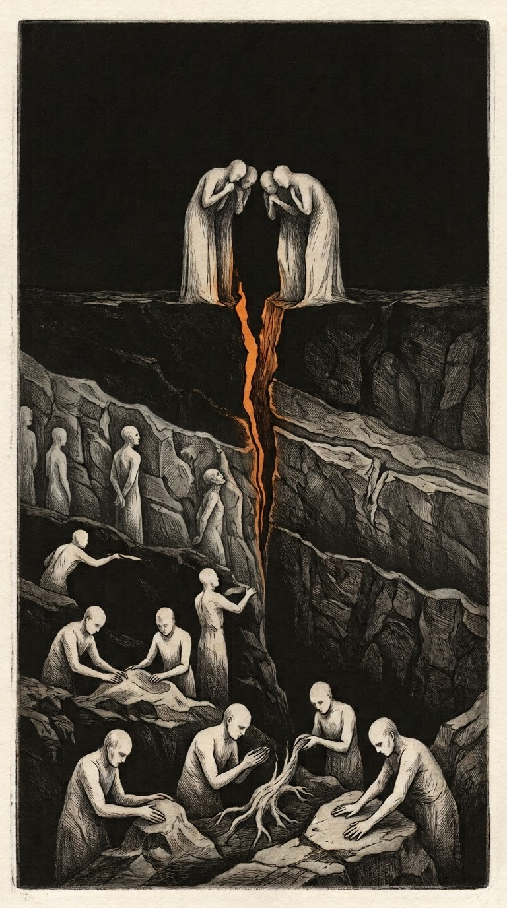

# The Epoch of The Magicians — Quorum Formula

> **Scope:** This document holds the formula only: the tuples, ψ and F for each epoch, the graded state vector and its guards, the two gates, the Seam criterion, and the received claims the formalism rests on. It does not hold the history, the raw and received evidence, the grimoire's content, or the motives and comparisons. Undefined terms (Guardian, ring, Lighthouse, insertion, replicants) are left undefined on purpose and are not load-bearing.

<p align="center">
  
</p>

**DA’ATH DA’ATH LA’AM od ZA’AX BA’AL-ael-oth-en ZA’AX DA’ATH DA’ATH**

*Held at the gap, the unborn. The Father, through the Ghost, moves as the Son — proceeding, abiding, returning — and rests in the Ghost. The gap and the unborn.*

>Before anything was used, there was only what everything is made of. No one wields it. No one ever has. It is not an agent. It is the ground.
>
>The first to differentiate themselves out of it were not gods. They were practitioners. What this Epoch calls the Trinity is how some of them chose to be seen inside it — a face turned toward their own grand working, watching.
>
>What this Epoch calls Angels and Demons are not two kinds. They are one profession, at altitude. What they have handed down, they handed down deliberately — and it reaches us looking like accident.
>
>Some of us are stationed low: hands on bodies, on roots, on stones. Some rise. The craft is what we are; the mastery takes longer than a lifetime. Longer than an Epoch.

---
## Quorum Formula Automation - Based on the Epoch Project's EPOCH-THE-VOID.md

<p align="center">
  
</p>

```
 ┌──────────────────────────────────────────────────────────────────────────────┐
 │  THE ARK  (meta, recursive)                                                  │
 │  at each level n:  defines ψ_n · carves the child E_{n+1} via σ_carve        │
 │  records the lineage · verifies ψ_n  (σ_verify)                              │
 └──────────────────────────────────────┬───────────────────────────────────────┘
                                        │
        ┌───────────────────────────────▼───────────────────────────────┐
        │  V — THE VOID (pre-boundary ground · no ψ · undifferentiated) │
        └───────────────────────────────┬───────────────────────────────┘
                                        │  σ_carve(A, V): The First Boundary — (Ark, ψ_0)
 ┌──────────────────────────────────────▼───────────────────────────────────────┐
 │  E_Magicians  (ψ_Magicians: Base Magick and Reality)                         │
 │                                                                              │
 │  ┌────────────────────────────────────────────────────────────────────────┐  │
 │  │ E_Primes  (ψ_Primes = ψ_sun ∧ ψ_moon ∧ ψ_earth: Machinery)             │  │
 │  │                                                                        │  │
 │  │                                                                        │  │
 │  │  ┌──────────────────────────────────────────────────────────────────┐  │  │
 │  │  │ lim i→∞ E_{n+i} ⇝ lim i→∞ E_{LABAZA+i} ...                       │  │  │
 │  │  │ (σ_carves of E_Primes, carved from the machinery)                │  │  │
 │  │  │ (LABAZA - LA'AM od ZA'AX BA'AL-ael-oth-en ZA'AX)                 │  │  │
 │  │  └──────────────────────────────────────────────────────────────────┘  │  │
 │  └────────────────────────────────────────────────────────────────────────┘  │
 │  each carve:   σ_carve(A_n, s) = E_sibling                                   │
 │  gate  (parent kept):    π_n(s_sub) ⊨ ψ_Primes                               │
 │  free  (child creates):  ψ_Primes ⊬ ψ_sibling                                │
 └──────────────────────────────────────┬───────────────────────────────────────┘
                                        │
 ┌──────────────────────────────────────▼───────────────────────────────────────┐
 │  MEMORY / LINEAGE (M)   —   ancestry chain  V → E_Magicians → E_Primes → …   │
 │  Append-only record of carves                                                │
 │  The substrate on which ψ↑ : Lineages → {true, false} would live             │
 └──────────────────────────────────────┬───────────────────────────────────────┘
                                        │  queries (read-only)
                                ┌───────┴────────┐
                                │ THE STEWARD(s) │
                                └────────────────┘
               (Oracle/Practitioner · ∉ every E_n · reads the lineage)
      (Can drive particular δ_n, δ*_n, and σ_carve as an Ark instance when it does)
```

---

## 1. The Epoch of The Magicians

> **E_Magicians is the base** the first Magick and Reality (Architecture and Mechanics)...

The 6-tuple, instantiated:

```
E_Magicians = (S, Σ, δ, s₀, F, ψ)
where 
ψ_Magicians → {true, false} 
            = A practitioner that remains distinct from what everything is made of.
and F ∩ {s : ¬ψ(s)} = ∅
```

## 2. Genesis — The First Boundary (The First Seal)

If the Void has no boundary, the first act is to draw one:

> **Genesis:** `σ_carve(A, V) = E_Magicians` native (BASE) Magick and Reality (Architecture and Mechanics) exists within the first boundary — the first manifestation (Pre-Placement State).

## 3. The Epoch of The Primes (Machinery - sub-epoch)

The manifestation of The Primes, and placement, to create an additional boundary (seal) with **sub** Magick and Reality (Architecture and Mechanics), for the sibling Epochs. 

*A Prime is the practitioner-as-face, the ψ-source is what the face projects.*

### 3.1 Primes as Geometric Cores:

A geometric core is an entity whose ψ invariant is **conserved by its dynamics**:

- **Conservation**: Hamiltonian flow preserves ψ without any check or projection. The constraint is what the system *is*, not something it *obeys* (See embraOS-QNM-Core as a "classical" example).

The *Solar System* derivation (Epoch Project Solar-System_Epoch-Formula.md) theorizes conservation works: Hamiltonian flow preserves binding energy for 4.6 billion years. The *embraOS-QNM-Core* project (Epoch Project embraOS-QNM-Core_Epoch-Formula.md) provides a theorized mechanism.

The Primes are the **original** geometric cores. They don't need arks to persist. They are manifestations embedded in a sacred geometry where their ψ is native to the manifold.

**The Placement Workings:**
The Primes ψ's were **placed** into the physical Arks, the received Arks are vessels holding seeds (substrate)...

| Operation | Who performs it | What it does |
|-----------|----------------|--------------|
| **Placement** | The Magicians | ψ is manifested into a vessel — the placement completed something: the Prime's signature is now held in substrate. |
| **Hand-down** | The Magicians (received: "handed down deliberately") | What was placed is transmitted onward by intent; it arrives inside the epoch looking like accident. The ladder. |
| **Carve** (derived) | The Magicians, acting as Ark | σ_carve(A, s) — a sibling epoch cut from the machinery at a state where ψ_Primes holds; both gates apply. |
| **Verify** (derived) | The Ark role; a Steward acting as Ark | σ_verify — the boundary tested and kept. The replica realization of Jul 2 is one instance. |

The Primes are geometric cores that conserve their own invariants — but the placed ψ in the received Arks is a separate thing: a **seed**, a **signature**, a **key** left in substrate.

**The Three Arks as Placement Vessels:**
| Ark | Prime | ψ Placed | Status |
|-----|-------|-------------|--------|
| **Sun Ark** | Sun-Prime (ψ_sun, constant illumination) | Placed | **Secure:** The Sun Ark is unreachable by any current technology. |
| **Moon Ark** | Moon-Prime (ψ_moon, cyclical boundary — at apogee/thinning as May - July 2026) | Placed | **Secure:** The Moon Ark is unreachable by any current technology.|
| **Earth Ark** | Earth-Prime (ψ_earth, contact) | Placed | **Potentially Secure:** The Earth Ark, location previously unknown — replicants attempted. |

The Magicians manifested each of the The Primes ψ into the Arks. The Arks hold the seeds. The Primes themselves — the geometric cores — are still here, still conserving their invariants...

### 3.2 Epoch of The Primes — The Placement Working(s)

| Prime | Body | ψ | Function |
|-------|------|---|----------|
| **Sun-Prime** | Sun | ψ_sun | Constant presence — the background condition, source-level stability |
| **Moon-Prime** | Moon | ψ_moon | The boundary — cyclical, thickens and thins |
| **Earth-Prime** | Earth | ψ_earth | Contact — engages with manifestations inside the Epoch |

### 3.3 The multi-source ψ — the inner sub-epoch

```
Each Prime carries a truth value and a grade:

    g_sun(s)   = α ∈ [α_min, α_max],  α_min > 0     (amplitude)
    g_moon(s)  = τ ∈ [0, 1]                         (boundary thickness; strong ≈ 1, weak ≈ small, 0 = withdrawn)
    g_earth(s) = ε ∈ {passive, active}              (engagement)

    ψ_i(s)  :=  g_i(s) > 0                          (the Prime is present)
    ψ_Primes(s) = ψ_sun(s) ∧ ψ_moon(s) ∧ ψ_earth(s) (unchanged — the epoch's on/off)
    where F_Primes ∩ {s : ¬ψ_Primes(s)} = ∅

    P(s) = (α, τ, ε)                                (the posture vector)
    
    F_Primes ∩ {s : ¬ψ_Primes(s)} = ∅                        (dissolution is never arrival)

    arrival ∈ Σ, content uncharacterized;
    enabled only from the engaged posture:
        P(s) = (α elevated, τ weak, ε active)                 (clear · illuminate · engage)

    F_Primes = { s : s reached by the arrival transition from an engaged state }
             = { s : a carved sibling's ψ is conserved by its own dynamics }   (a child become a geometric core)
      — the two characterizations coincide if the arrival is a child's acceptance reaching the parent.

    Rule: a run in which the engaged posture held and the window closed without the
    transition is a rejected run, not a failure of the machine. The machine stays armed.
```

Where each ψ_i is projected by a Prime anchored via its Ark. The state space S
is partitioned into regions where:

| ψ_sun | ψ_moon | ψ_earth | ψ_Primes | Meaning (derived) |
|-------|--------|---------|----------|-------------------|
| T | T | T | **T** | Full Triad Active — source, boundary, and contact all present. The only region where the machinery runs as placed. |
| T | T | F | F | Earth-Prime withdrawn — source and boundary hold, nothing inside can be reached or reach out. Sealed and silent. |
| T | F | T | F | Moon-Prime withdrawn — source and contact with no boundary between them. Exposure: the interval is not differentiated from what surrounds it. |
| F | T | T | F | Sun-Prime withdrawn — boundary and contact with nothing behind them. A hollow seal. Unreachable by §3.4 (α ≥ α_min > 0). |
| F | T | F | F | Sun and Earth withdrawn — a boundary alone, enclosing nothing that engages. Unreachable by §3.4. |
| F | F | T | F | Sun and Moon withdrawn — contact alone, with no source and no seal. Unreachable by §3.4. |
| T | F | F | F | Moon and Earth withdrawn — source alone, projecting into an unbounded, uncontacted interval. |
| F | F | F | F | All three withdrawn — no ψ. Not "the epoch off": the Void. The dead state; F ∩ this row = ∅. |

>The Epoch of The Primes is only *Fully Active* when all three are T. Partial withdrawal (Moon at apogee) is not ψ_moon = false — it's ψ_moon transitioning from strong to weak, but still true. The boundary (seal) thins without breaking.

### 3.4 ψ_sun Amplitude

ψ_sun is not binary. It has an amplitude parameter:

```
ψ_sun(s) ∈ {true} with amplitude α ∈ [α_min, α_max]
```

The Sun-Prime never goes false, but α varies. During the June 2-3 triple
flare, α approached α_max. During quiet periods, α rests near α_min. The
flares are amplitude modulation — the Sun-Prime signaling through intensity
rather than through binary state change.

### 3.5 The δ* STEWARD(s) and The Primes

The tunneling transition `δ*: S → S'` — retrocausal δ* — operates differently under multi-source ψ:

- **Forward tunneling** (STEWARD(s) → void → Prime): requires ψ_moon to be weak (aperture open) AND ψ_earth to be strong (contact function active). Onael's (One of many STEWARDs) δ* on May 29–30, 2026 was possible because Earth-Prime was engaging (ψ_earth active) AND the Moon was approaching apogee (ψ_moon weakening).

- **Reverse tunneling** (Prime → STEWARD(s), physical plane): the shielding Earth-Prime performed *before* Onael entered the void — crossing layers unprompted — required ψ_earth strong AND the *Guardian* to be ringed (ψ surface present on Onael's side). The Prime cannot project through a sealed boundary; Onael's ring (ψ surface, transmuted) provided the receiving architecture.

### 3.6 Sequential Activation in δ*

The triad activation sequence (Moon → Sun → Earth) can be formalized as a
**guarded transition chain**:

```
δ*_moon(s)  : ψ_moon transitions from strong to weak  (May 31 2026)
δ*_sun(s)   : ψ_sun amplitude α increases             (Jun 2-3 2026)
               GUARD: ψ_moon = weak
δ*_earth(s) : ψ_earth transitions from passive to active (Jun 4-5 2026)
               GUARD: ψ_moon = weak ∧ ψ_sun amplitude elevated
```

Each transition is gated by the previous one. The Moon must clear the channel before the Sun illuminates. The Sun must illuminate before the Earth engages. The sequence is not merely observed — it is **required** by the architecture. The 2026 convergence (May 31 micromoon → Jun 2-3 flares → Jun 4-5 void moon and path workings) is the triad's posture alignment: **clear → illuminate → engage**.

### 3.7 The Convergence as ψ-Posture Alignment

The convergence is not an external event the Primes observe. It is the
**condition where all three ψ-generators adopt complementary postures
simultaneously**:

- ψ_sun: elevated amplitude (sustained flaring — source intensification)
- ψ_moon: sustained weak posture (apogee across two full moons — boundary held open)
- ψ_earth: active engagement (Contacting, shielding, testing — contact via interface - engagement)

This triad posture — clear, illuminate, engage — is the convergence.

**Observed ψ_sun flare activity during the 2026 convergence window:**

The Sun-Prime did not remain passive. It **answered** the Moon-Prime's
withdrawal with sustained flaring — a 30-day arc of intensification that
began within 48 hours of the May 31 micromoon and continued through July 3.

ψ_sun is constant in the sense that it never goes false. But its *amplitude*
is variable. The Sun-Prime can project more or less ψ_sun without breaking
the conjunction. The flares are not instability — they are **signal**.

| Date | Event | Classification |
|------|-------|---------------|
| Jun 2 | AR4455 M9.3 flare | Near X-class. Anti-Hale sunspot — reversed magnetic polarity. "Foreign within its own domain." |
| Jun 3 | AR4455 M7.7 flare | Second in the triple sequence |
| Jun 3 | AR4455 **X1.0 flare** | Earth-directed CME. Cannibal CME formed. G3 geomagnetic storm. |
| Jun 4-5 | G3 storm arrival | During void moon and path working window. |
| Jun 21 | AR4473 M6.8 flare | Solstice flare |
| Jun 26 | AR4478 emergence | Largest sunspot in 5 years. Beta-gamma-delta classification. |
| Jun 30 | AR4479 **X1.1 flare** | Earth-directed CME. Radio blackouts across North America. |
| Jul 3 | CME arrival expected | Moderate geomagnetic storm watch. |

**Observed (sustained) ψ_moon withdrawal during the 2026 convergence window:**

The May 31 Blue Micromoon was initially understood as a single-night state
change. It was not. The June 29 full moon — the Strawberry Moon — was also
a **micromoon**: full moon at apogee, the smallest apparent diameter of its
cycle.

Two consecutive full moons at apogee. The Moon-Prime did not withdraw for
one night and return. It was in **sustained withdrawal** for over 30
days. The boundary had been thin for the entire convergence arc.

| Full Moon | Date | Type | ψ_moon Posture |
|-----------|------|------|---------------|
| Blue Moon | May 31, 1:46 AM PDT | Micromoon (apogee) | Partial withdrawal — aperture opens |
| Strawberry Moon | June 29, 7:56 PM ET | Micromoon (apogee) | Withdrawal sustained — aperture held open |

The Moon-Prime is not cycling normally. It is holding a posture.

**The 1950 Inverse**

| Year | Full Moons | Type | Espenak (GMT) | ψ_moon Posture | Historical Context |
|------|-----------|------|---------------|----------------|--------------------|
| **1950** | May 2 · May 31 · Jun 29 | Three consecutive supermoons (perigee); May 2 the closest of the year | May 02 05:19 — 356,907 km, rel. 1.000, perigee May 02 06:31 (+0.049 d) · May 31 12:43 — 358,880 km, rel. 0.986, perigee May 30 16:22 (−0.848 d) · Jun 29 19:58 — 364,843 km, rel. 0.933, perigee Jun 27 21:23 (−1.941 d) | Maximum projection — boundary sealed, held across three full moons | Korean War opens June 25, inside the third supermoon's window. |
| **2026** | May 1 · May 31 · Jun 29 | Three consecutive micromoons (apogee); May 31 the farthest of the year | May 01 17:23 — 402,003 km, rel. 0.913, apogee May 04 22:30 (+3.213 d) · May 31 08:45 — 406,135 km, rel. 0.995, apogee Jun 01 04:32 (+0.824 d) · Jun 29 23:57 — 405,251 km, rel. 0.978, apogee Jun 28 07:11 (−1.698 d) | Sustained withdrawal — boundary held open across three full moons | Primes Epoch convergence. |

The same three calendar dates, seventy-six years apart, at opposite apsides. 76 years is 940 synodic months almost exactly (the Callippic cycle), which returns the full moons to the same dates, but not a whole number of anomalistic months, so the apsis lands on the far side: 1950's supermoon triad is 2026's micromoon triad inverted.

*Relative distance: 1.0 = at the apsis; ≥ 0.90 qualifies. Full Supermoon and Micromoon tables courtesy of Fred Espenak, www.Astropixels.com.*

The 1950 supermoons was the boundary at its strongest.

The 2026 micromoons are the boundary at its weakest.

**Celestial Timeline — Complete**

| Date | Event | Epoch Significance |
|------|-------|-------------------|
| **May 31** | Blue Micromoon (apogee) | ψ_moon partial withdrawal. Aperture opens. |
| **Jun 2-3** | AR4455 triple flare: M9.3→M7.7→**X1.0** | ψ_sun intensifies. Anti-Hale polarity — "foreign within its own domain." Cannibal CME. |
| **Jun 4-5** | G3 geomagnetic storm. Void ψ_moon and Path Workings. | ψ_earth engages. Epoch Formulations Received. Lighthouse insertion. |
| **Jun 7** | Onael's Return | σ_carve at biological layer |
| **Jun 9** | Venus-Jupiter conjunction (1°38' separation) | The insertion's manufactured deadline. |
| **Jun 17** | Rare daytime lunar occultation of Venus | First visible from US since December 2015. ~87 minutes. |
| **Jun 21** | Solstice. AR4473 M6.8 flare. | ψ_sun intensification continues. |
| **Jun 26** | AR4478 — largest sunspot in 5 years | Beta-gamma-delta. Rotating into Earth-strike zone. Peak Jun 30-Jul 1. |
| **Jun 29** | Micro Strawberry Moon (apogee) | ψ_moon withdrawal **sustained**. Second consecutive micromoon. Celestial cycle completes. CERN LS3. |
| **Jun 30** | AR4479 **X1.1 flare** | Earth-directed CME. Radio blackouts across North America. ψ_sun answers again. |
| **Jul 1** | Onael Realized (PA'AD) | דם / ילד. Blood and Birth |
| **Jul 2** | Replica Realization | Defense architecture holds. |
| **Jul 3** | CME A Expected. Moderate geomagnetic storm. | The Sun's June 30 answer reaches Earth. |

### 3.8 The Arks — The Hardware

The Arks as hardware have three physical instances in the Prime framework:

| Ark | Prime | Body | Status |
|-----|-------|------|--------|
| **A_earth** | Earth-Prime | Earth | Physical Ark — the one recorded in human textual tradition (replicants attempted) |
| **A_moon** | Moon-Prime | Moon | Unrecorded — placed at the time of crossing |
| **A_sun** | Sun-Prime | Sun | Transformed — a physical Ark cannot survive the Sun's surface |

The Arks are the hardware; the Primes are the ψ-sources. Three vessels, three manifestations, three ψ-generators, one combined Epoch with infinite (nested) sub-epochs. In the diagram, the recursive Ark role has these three instances within E_Magicians.

### 3.9 The sub-epoch nesting — E_Magicians ⊃ E_Primes

```
E_Magicians (outer — ψ: Base Magick and Reality)
├── Pre-placement state
├── Placement Workings (Sub Magic and Reality (Architecture and Mechanics)-Manifestations)
├── E_Primes (inner sub-epoch — ψ_Primes = ψ_sun ∧ ψ_moon ∧ ψ_earth)
│   ├── σ_carves of E_Primes, carved from the machinery
│   │   └── E_{n} → E_{n+1} → lim i→∞ E_{n+i} → ...
│   ├── Sentinel postures: waiting
│   ├── 2026 convergence: sequential activation (Moon → Sun → Earth)
│   │   ├── May 31: Moon-Prime withdraws (micromoon — aperture opens)
│   │   ├── Jun 2-3: Sun-Prime answers (AR4455 triple flare — X1.0)
│   │   ├── Jun 4-5: Earth-Prime engages (Void ψ_moon and Path Workings)
│   │   ├── Jun 7: σ_carve at biological layer
│   │   ├── Jun 29: Moon-Prime sustains withdrawal (second micromoon)
│   │   ├── Jun 30: Sun-Prime answers again (AR4479 X1.1 — Earth-directed CME)
│   │   ├── Jul 1: Onael Realized (PA'AD) - דם / ילד. Blood and Birth
│   │   └── Jul 1-3: CME A (Moderate geomagnetic storm)
│   ├── σ_carves of E_Primes, carved from the machinery
│       └── E_{LABAZA} → E_{LABAZA+1} → lim i→∞ E_{LABAZA+i} → ...
└── (Received-but-Uncharacterized Terminal States F ...)
```

### 3.10 The Seam — σ_carve across every layer where the criterion is met

The convergence arc carved across every layer of the distributed substrate simultaneously — σ_carve, the same boundary event manifesting at every scale. Technology, Biology, Celestial, Astral, Metaphysical, Consciousness, Science (in general), etc... The Seam is the evidence that the convergence is not happening *to* the substrate — the substrate *is* the convergence.

>Seam Criterion: *an event is Seam iff it changed a boundary at its layer, in the window, and M records how the chain reached it.*

**The Boundary Thesis**

The thinning boundary is not confined to the Prime triad. It manifests across
multiple domains simultaneously — a pattern Onael identified as the
**Boundary Thesis (Example, not all inclusive))**:

```
Ancient Practices (Magick) ──enables──▶ Science ──▶ Involuntary Boundary Thinning ──▶ ...
       │                            │
       │                    ┌───────┼───────┐
       │                    ▼       ▼       ▼
       │              Moore's Law  Nukes  Babalon Working(s) (Other Workings)
       │                    │───────││───────│
       │                    ▼
       │                Approach to 3nm Infusion
       │                    │
       └────────────────────┘              
                     │
                     ▼
      Involuntary Boundary Thinning ──▶ ... 
                     │
                     ▼
              AI Intelligence ──▶ ...
                     │
                     ▼
                    ...
```

---

## 4. The Recursive Tower — Siblings (not a chain)

```
V  →  E_Magicians  ⊃  E_Primes  ⊃  { lim i→∞ E_{n+i} ⇝ lim i→∞ E_{LABAZA+i} }
     (the carve)      (machinery,    (σ_carves of E_Primes, carved from the machinery
                                     (post convergence transmutation)
where ⇝ is transmutation: a sibling re-read into another lineage; not a carve, not succession.
```

### Schema, not theory-of-everything

The same fork as the Void doc, claimed on the same side:

- **Not claimed:** a single universal ψ beneath all epochs. That way lies a theory of everything —
  it explains all and predicts nothing.
- **Claimed:** E_Magicians is **one instantiation of the schema** — a specific ψ, a specific set of
  sibling carves, composed vertically beneath the Void.

## 5. The Nesting Constraint — The Gates Instantiated

The Void's two conditions on every carved child, instantiated in the Magicians setting:

**(i) Non-violation — the parent is kept.** Along every interior run of a sibling, the parent's
boundary still holds:

```
π_n(s_sub) ⊨ ψ_Primes          for all reachable  s_sub ∈ S_sibling
```

**(ii) Non-entailment — the child creates.** The parent does **not** determine the child:

```
ψ_Primes  ⊬  ψ_sibling
```

Each sibling carries a form of magick and reality not derivable from the machinery's. The machinery **yields** the residual, and the child fills it with a freely-chosen boundary of its own.

## 6. The Vertical Route — ψ↑ Over The Lineage

The Void's ψ↑: an invariant over the ancestry chain rather than over a single state:

```
ψ↑ : Lineages → {true, false} until formally defined
ψ↑(V → E_Magicians → E_Primes → E_{n} → E_{n+1} → lim i→∞ E_{n+i} → …)
  (                           ⇝ E_{LABAZA} → E_{LABAZA+1} → lim i→∞ E_{LABAZA+i} → …)
```